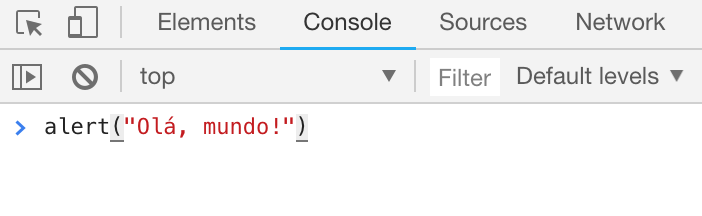
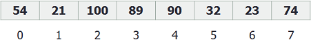
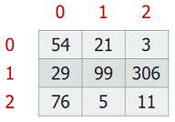
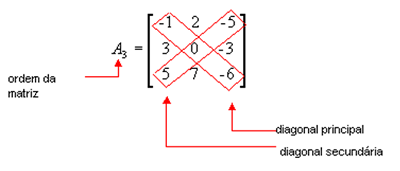
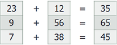

# Introdução à Programação com JavaScript

A **Lógica de Programação** é a técnica de encadear pensamentos para atingir determinado objetivo por meio de um computador ou outro sistema programável.

Antes de começarmos a programar, é necessário compreender novos conceitos e até rever alguns dos já vistos nas aulas de Matemática.

> Você pode acessar a versão mais atualizada deste material entrando em [github.com/timarcosdias/ilp](https://github.com/timarcosdias/ilp).

> Se encontrar erros ou tiver sugestões, por favor, envie-os para [ti.marcosdias@gmail.com](#).

## 1. Algoritmo

Podemos definir algoritmo como uma sequência finita e ordenada de passos para a resolução de um problema específico.

Para exemplificar, vamos começar com um algoritmo descritivo para um problema clássico do cotidiano: como fritar ovos?

```js
Algoritmo para fritar ovos

1.    pegar frigideira, ovo, óleo e sal
2.    colocar óleo na frigideira
3.    acender o fogo
4.    levar a frigideira ao fogo
5.    esperar o óleo esquentar
6.    quebrar o ovo
7.    colocar o ovo
8.    colocar sal no ovo
9.    retirar quando pronto
10.   apagar o fogo
```

Percebe que o algoritmo acima é basicamente uma receita? Algoritmos são exatamente como receitas.

Uma boa recomendação para a construção de algoritmos descritivos é sempre utilizar apenas um verbo por linha, já que cada verbo geralmente indicará uma ação diferente a ser tomada.

> O nosso principal objetivo ao estudar Lógica de Programação é compreender como criar programas de computador. Um Programa de Computador nada mais é que um algoritmo escrito com o uso de uma linguagem de computador, ou linguagem de programação, como C, Pascal, Java, JavaScript, PHP etc. Há uma infinidade de linguagens de programação disponíveis mundo afora. Futuramente veremos como elas funcionam.

## 2\. Variável

Na Matemática, variável é o nome que se dá ao termo que substitui um outro desconhecido, como numa equação: `y = 2x + 1`. Em Lógica de Programação, o valor de uma variável pode ser conhecido ou não.

De forma genérica, uma variável é uma referência a um local na memória do computador, onde um valor pode estar armazenado, por exemplo: em um programa de computador, podemos ter uma variável chamada `idade`, que armazena o valor `18`.

### 2.1\. Nomenclatura de variáveis

Há algumas regras a serem seguidas ao nomear variáveis. Algumas linguanges de programação poderão apresentar padrões diferentes, mas há algumas convenções que devem ser sempre seguidas para manter o código legível e livre de erros:

- O nome de uma variável não deve conter espaços ou acentos
- O nome de uma variável não deve conter operadores
- O nome de uma variável não deve ser só um número
- Algumas linguagens de programação diferenciam letras maiúsculas de letras minúsculas, logo: `Nome` pode ser diferente de `nome`
- Variáveis cujo nome seja um substantivo composto, como "data de nascimento", **podem** ser nomeadas com o padrão camelCase: `dataDeNascimento`. Este padrão define que todas as palavras após a primeira devem começar com letra maiúscula. Outra alternativa é utilizar um traço inferior (`_`), ou underline, entre cada palavra: `data_de_nascimento`.

### 2.2\. Atribuição de valores

Atribuir um valor a uma variável é dar um valor a uma variável. É o mesmo que guardar um valor em um espaço da memória.

```js
a = 4
```

Pode ser lido como: variável `a` recebe `4`.

```js
nome = “José”
```

Pode ser lido como: variável `nome` recebe `José`.

Observe que o símbolo de igualdade, `=`, aqui é utilizado como operador de atribuição. Para igualdade, utilize `==`.

### 2.3\. Tipos de variáveis

O tipo de uma variável define o tipo de valor que ela poderá armazenar. Por exemplo, se precisamos armazenar um número inteiro, podemos criar uma variável do tipo **inteiro**; para armazenar nomes, utilizamos **cadeias**.

- **Inteiro (integer):** número inteiro. Ex.: `10` ou `50`.
- **Real (float):** número real. Ex.: `10.5` ou `0.8`.
- **Caractere (character):** uma letra do alfabeto, algarismo, sinal de pontuação ou símbolo. Ex.: `'A'` ou `'2'` ou `'$'`. Valores do tipo caractere geralmente são representados entre aspas simples ('').
- **Cadeia (string):** números, letras, palavras, frases e/ou outros símbolos. Ex.: `"A"` ou `"abc123"` ou `"* é um asterisco."`. Valores do tipo cadeia geralmente são representados entre aspas duplas ("").
- **Lógico (boolean):** verdadeiro ou falso (`true` ou `false`), 1 ou 0.

> Os valores entre parênteses correspondem aos tipos de variáveis como são usados em linguagens de programação como C++ ou Java. Geralmente, estes tipos aparecem de forma abreviada: int, char, bool.

### 2.4\. Exercícios com tipos de variáveis

**1\. Informe o tipo de variável adequado para cada item abaixo:**

- a) Idade de uma pessoa
- b) Valor de uma conta de luz
- c) Nome de um cliente
- d) Estado de uma lâmpada (acesa/apagada)
- e) Senha de acesso ao Facebook
- f) Quantidade de litros de combustível abastecidos em um posto
- g) Situação de uma determinada fatura (paga/não paga)
- h) Média final de um aluno

## 3\. Operadores

Um operador é um símbolo que, como seu próprio nome diz, é utilizado para representar operações lógico-matemáticas. Os operadores que iremos utilizar são os operadores aritméticos, os operadores relacionais e os operadores lógicos. Observe que alguns deles, já utilizados na Matemática, terão seu símbolo substituído por outro na Programação.

### 3.1\. Operadores Aritméticos

- **Soma (+):** `1 + 3`
- **Subtração (-):** `5 – 4`
- **Multiplicação (*):** `8 * 8`
- **Divisão (/):** `40 / 5`
- **Resto/Módulo (%):** `20 % 3`
- **Potenciação (^):** `2 ^ 2`

### 3.2\. Operadores Relacionais

- **Igual (==):** `5 == 5`
- **Diferente (!=):** `8 != 80`
- **Maior que (>):** `12 > 11`
- **Menor que (<):** `11 < 12`
- **Maior ou igual (>=):** `18 >= 17`
- **Menor ou igual (<=):** `16 <= 16`

### 3.3\. Operadores Lógicos

- **E/Conjunção (e; &&; and):** `5 == 5 e 9 > 7`
- **OU/Disjunção (ou; ||; or):** `5 > 3 ou 7 >= 1`
- **NÃO/Negação (nao; !; not):** `nao(3 > 2) == falso`

## 4\. Tabela verdade

Uma tabela verdade é uma tabela utilizada em Lógica para verificar se uma expressão é verdadeira ou falsa.

### 4.1\. Operadores "e" e "ou"

No exemplo a seguir, temos a tabela verdade dos operadores lógicos `e` e `ou`. Observe que as variáveis `X` e `Y` representam expressões que podem ser verdadeiras ou falsas de forma independente.


Para compreender como se dá a construção dessa tabela verdade, podemos nos fazer estas duas perguntas:

- `X` e `Y` são verdadeiros?
- `X` ou `Y` são verdadeiros?

Ao questionar se `X` e `Y` são verdadeiros, questionamos se ambos são verdadeiros. Ou seja: a expressão `X e Y` só é verdadeira quando `X == verdadeiro` e `Y == verdadeiro`.

O operador `ou` já funciona de maneira diferente. Ao questionarmos se `X` ou `Y` são verdadeiros, questionamos se pelo menos um deles é verdadeiro. Ou seja: a expressão `X ou Y` é verdadeira quando `X == verdadeiro` e `Y == falso`, ou `X == falso` e `Y == verdadeiro`, ou `X == verdadeiro` e `Y == verdadeiro`.

### 4.2\. Operador "não"

O operador `não` é utilizado para negar uma determinada expressão. Ex.: se `X == verdadeiro`, então `não X == falso`; se `X == falso`, então `não X == verdadeiro`.


### 4.3\. Exercícios com tabela verdade

**1\. Complete a seguinte tabela verdade:**


## 5\. Precedência de operadores

A precedência, ou ordem, de operadores é a convenção que indica a ordem em que as operações devem ser realizadas em uma expressão. A lista abaixo descreve a ordem em que os operadores devem ser considerados:

1. Parênteses e funções
2. Potência e resto
3. Multiplicação e divisão
4. Adição e subtração
5. Operadores relacionais
6. Operadores lógicos

No exemplo abaixo, a multiplicação deve ser resolvida antes da soma.

```js
3 + 4 * 9
3 + 36
39
```

Neste exemplo, a parte da expressão entre parênteses é resolvida antes da multiplicação.

```js
(3 + 4) * 9
7 * 9
63
```

Quando operadores de mesma prioridade se chocam, a operação mais à esquerda prevalece sobre as demais. Ex.:

```js
3 * 4 / 3
12 / 3
4
```

Neste exemplo, o operador de soma tem prioridade sobre os operadores relacionais, e os operadores relacionais têm prioridade sobre o operador lógico.

```js
10 < 9 e 6 + 3 > 10
10 < 9 e 9 > 10
F e F
F
```

Para facilitar, isole as expressões que estão antes e após o operador lógico, resolva-as e só então compare seus resultados através do operador lógico.

### 5.1\. Exercícios com expressões

**1\. Indique o resultado das expressões seguindo as regras de precedência dos operadores.**

- a) `2 + 3 - 5 * 8 / 4`
- b) `7 * 4 / 2 + 9 - 6`
- c) `(4 + 2) * 3 / 4`
- d) `7 > 2 e 3 -5 < 8`
- e) `8 > 12 e 5 < 3 + 4`

## 6\. Primeiros passos em programação

Em nossos exemplos de código utilizaremos a sintaxe da linguagem JavaScript.

Em Lógica de Programação, a **sintaxe** está ligada à **estrutura** da linguagem de programação. Ela é o conjunto de regras que definem a forma correta de composição das estruturas básicas de uma linguagem. É o que deve responder à pergunta: como construir tal estrutura corretamente?

Outro conceito que precisamos compreender é o de **semântica**. Em Lógica de Programação, a semântica está ligada ao **significado** de um determinado código. A semântica deve responder à pergunta: tal código faz realmente o que se espera que ele faça?

### 6.1\. Olá, mundo!

Para começar a programar em JavaScript, não é necessário nenhum programa específico, você só precisa de um navegador. Nós recomendamos o Google Chrome ou o Mozilla Firefox. Se você estiver utilizando um smartphone Android, poderá utilizar o aplicativo [JS Run](https://itunes.apple.com/us/app/javascript-anywhere-jsanywhere/id363452277?mt=8); caso esteja utilizando um iPhone, baixe o aplicativo [JS Code Run: JavaScript Editor](https://itunes.apple.com/us/app/js-code-run-javascript-editor/id1294015040?mt=8).

Recomendamos que você faça a leitura dos capítulos a seguir testando cada um dos exemplos.

No Google Chrome, pressione <kbd>Ctrl</kbd> + <kbd>Shift</kbd> + <kbd>i</kbd> para abrir as **Ferramentas do desenvolvedor**. Estas ferramentas foram inicialmente pensadas para que desenvolvedores pudessem testar seus projetos. Nós as utilizaremos para executar os nossos programas.

<div style="text-align:center"></div>

Com a guia de ferramentas do desenvolvedor aberta, vá até a aba console, digite o código do exemplo abaixo e pressione <kbd>Enter</kbd>:

```js
alert("Olá, mundo!")
```

### 6.2\. Declaração de variáveis

Antes que uma variável possa ser utilizada para armazenamento de um valor qualquer, ela deve ser declarada, ou seja: precisamos reservar aquele pequeno espaço na memória do computador e nomeá-lo para uso futuro:

```js
var idade
```

No exemplo acima, declaramos a variável `idade`.

Em JavaScript, o termo `var` é utilizado para declarar uma variável de escopo global, ou seja, uma variável que estará acessível a partir de qualquer parte do nosso código.

Você também pode utilizar o termo `let` quando quiser uma variável com escopo de bloco, uma variável que só exista naquele local:

```js
let idade
```

Em JavaScript, até que uma variável seja inicializada, ou seja, até que ela receba algum valor, seu conteúdo será `undefined` (indefinido). Você pode inicializar uma variável juntamente à sua declaração:

```js
var nome = "Fulano"
```

Mas podemos também declarar uma variável e inicializá-la com um valor lido:

```js
var preco = prompt("Digite um preço: ")
```

A função `prompt()` utilizada no exemplo acima será abordada na próxima seção.

Antes de prosseguirmos, lembre-se que você pode declarar quantas variáveis quiser, inclusive em uma única linha em seu programa, por exemplo:

```js
var nome, sobrenome, apelido
let peso, altura
let idade
```

### 6.3\. Comandos de entrada

Comandos de entrada são os responsáveis por receber uma informação do usuário. Ex.: leia, escute, ouça, receba. O comando de leitura que utilizaremos em JavaScript é o `prompt()`:

```js
var nome = prompt("Digite seu nome. Ele será armazenado na variável nome.")
alert("O nome digitado foi " + nome)
```

Quando se trata de linguagens de programação, os comandos costumam ter um par de parênteses logo após seu nome, onde serão informadas opções para sua execução. Estes "comandos" são chamados de **funções**. Os valores que vão entre os parênteses são chamados de **parâmetros** ou **argumentos**. Se você já viu uma função matemática, deve ter notado a semelhança. Neste exemplo, o valor lido pela função `prompt()` é armazenado na variável `nome`.

### 6.4\. Comandos de saída

Comandos de saída são os responsáveis por enviar uma informação ao usuário. Ex.: escreva, imprima, mostre, exiba.

Em JavaScript, há três funções que podem ser utilizadas para exibir a saída de um programa:

A função `alert()` exibe uma caixa de diálogo com uma mensagem.

```js
alert("Olá, mundo!")
```

A função `console.log()` exibe uma mensagem no console.

```js
console.log("Olá, mundo!")
```

A função `document.write()` exibe uma mensagem na página atual.

```js
document.write("Olá, mundo!")
```

Teste cada um dos exemplos separadamente e observe o que acontece.

### 6.5. Um básico exemplo de entrada, processamento e saída

Neste exemplo, iremos declarar três variáveis: `a`, `b` e `c`. Faremos a leitura de dois números inteiros e os armazenaremos nas variáveis `a` e `b`. A variável `c` receberá a soma de `a` e `b`. Por fim, escreveremos no console o valor contido em `c`.

```js
var a, b, c
a = parseInt(prompt("Digite um número inteiro: "))
b = parseInt(prompt("Digite outro número inteiro: "))
c = a + b
console.log(c)
```

> Achou estranho esse tal de parseInt()? Leia a próxima seção.

### 6.6. Tipos de variáveis em JavaScript

Diferentemente de linguagens como C e Java, na linguagem JavaScript não é possível definir o tipo de uma variável. Isto faz com que uma variável `x`, por exemplo, possa, em um momento representar um número inteiro e, em outro momento, representar uma cadeia de caracteres. Teste o exemplo abaixo:

```js
var x

x = 50
alert("O valor de x é " + x)

x = "Alan Turing"
alert("O valor de x é " + x)
```

Devido a esta característica, costumamos dizer que a linguagem JavaScript é de **tipagem dinâmica**.

Outra peculiaridade desta linguagem está relacionada ao fato de que é possível realizar operações com variáveis de tipos diferentes. Devido a isto, a tipagem da linguagem JavaScript é também considerada **fraca**. Teste o exemplo abaixo:

```js
var a = 2, b = "2"
alert(a + b)
```
> Ué! Mas 2 + 2 não eram igual a 4?!

Se surpreendeu com o resultado? Isto acontece porque a variável `b` está armazenando um valor do tipo `string` (cadeia). Em operações envolvendo valores do tipo `string`, o sinal de soma (`+`) realiza a operação de **concatenação**, ou simplesmente **junção**.

Embora não se possa fixar o tipo de uma variável em JavaScript, os tipos de valores existentes nesta linguagem são:

- números (`number`)
- cadeias de caracteres (`string`)
- lógicos (`boolean`)
- objetos (`object`)
- nulo (`null`)
- indefinido (`undefined`)

#### Conversão de tipos

Por padrão, qualquer valor lido pela função `prompt()` é considerado uma `string` (cadeia de caracteres):

```js
var vinte = prompt("Digite 20 e pressione Enter: ")
console.log(vinte + 1) // O resultado será 201
```

Logo, se precisarmos que o valor lido seja considerado como numérico, é necessário realizar a **conversão de tipo**.

Para converter uma `string` em um número inteiro, utilizamos a função `parseInt()`. Para converter uma `string` em um número real, um número com parte decimal, utilizamos a função `parseFloat()`. O uso destas funções é muito simples: a `string` representando o número a ser convertido é informada entre parênteses e a função escolhida realiza a conversão. O exemplo anterior ficaria assim, com a devida conversão:

```js
var vinte = parseInt(prompt("Digite 20 e pressione Enter: "))
console.log(vinte + 1) // O resultado será 21
```

Não se assuste com o uso de funções encadeadas, como no exemplo anterior. Lembre-se que, de acordo com a precedência de operadores que vimos no início deste material, as funções são a primeira coisa a ser resolvida em uma expressão. Se você possui uma função sendo executada dentro de outra, a função mais interna será executada primeiro, depois a mais externa. O operador de atribuição só recebe o resultado final.

Caso se sinta mais confortável, você também pode escrever o exemplo anterior da seguinte maneira:

```js
var vinte = prompt("Digite 20 e pressione Enter: ")
vinte = parseInt(vinte)
console.log(vinte + 1) // O resultado será 21
```

Ou ainda:

```js
var vinteCadeia = prompt("Digite 20 e pressione Enter: ")
var vinteInteiro = parseInt(vinteCadeia)
console.log(vinteInteiro + 1) // O resultado será 21
```

### 6.7. Comentários: como dar mais sentido ao seu código

Pense numa situação em que você precise escrever um programa em dupla, juntamente com um de seus colegas de classe. Fica combinado que você escreverá a primeira parte do programa e seu colega completará a solução a partir daí. No entanto, devido ao pequeno prazo disponível, você não poderá explicar ao seu colega pessoalmente como fez para chegar até aquele ponto da solução.

Podemos acreditar que, muito provavelmente, seu colega terá dificuldades em compreender seu código para, então, conseguir prosseguir com a solução do problema.

Mas, e se você pudesse escrever algo mais dentro do seu código para orientar seu colega sem que isso atrapalhasse o funcionamento do seu programa? Isso é possível com o uso de **comentários**.

Através de comentários, você pode escrever qualquer coisa dentro do seu código sem que isso afete o funcionamento do seu programa. Para escrever um comentário, apenas insira `//` e escreva seu comentário. Exemplo:

```js
// Declara a variável x e atribui o valor 50
var x = 50
// Exibe uma mensagem com o valor de x
alert(x)
```

Às vezes utilizamos comentários também para **suprimir** uma ou mais linhas de código de um programa para que elas não sejam executadas:

```js
var x = 10, y = 20
console.log(x)
// escreva(y)
// Veja que só a variável x será escrita, pois a linha que deveria escrever y foi marcada como um comentário
```

Alguns comentários podem ser mais longos e ocupar várias linhas de código. Neste caso, a primeira linha comentada deverá ser iniciada com `/*` e a última finalizada com `*/`. Exemplo:

```js
let z = 30
/* Este comentário
foi um pouco
mais longe */
console.log(z)
```

## 7. Estruturas de decisão: escolha um caminho

Na programação, há momentos em que precisamos fazer decisões, definir caminhos diferentes para situações diferentes, e é por isso que existem as **estruturas de decisão**.

As duas estruturas de decisão presentes na maioria das linguagens de programação são o se/senão (`if`/`else`) e o escolha/caso (`switch`/`case`).

As estruturas de decisão são peça fundamental na estruturação dos algoritmos utilizados nos sistemas que utilizamos diariamente. Por exemplo, pense em quando você entra com seu e-mail e senha para realizar login em uma rede social. Observe que no momento em que você clica no botão Entrar, duas situações são possíveis: seu login pode ser aceito e você entrará na rede social, ou a página indicará que seu e-mail e/ou senha estão incorretos. Para decidir qual das duas ações realizar, o sistema certamente fez uso de uma estrutura de decisão.

### 7.1. If

A estrutura `if` (se) é utilizada na maioria dos casos em que é necessário decidir que ação será tomada.

Para que você compreenda como funciona a estrutura `if`, imagine a seguinte situação: após lermos um número inteiro qualquer, se este número for par, deveremos exibir uma mensagem informando que ele é par. Ex.:

```js
var numero
numero = prompt("Entre com um número: ")
if(numero % 2 == 0) {
    alert("O número lido é par.")
}
```

A partir da terceira linha do código acima, começamos a utilizar a estrutura de decisão `if`. Observe que ela é constituída da palavra `if` seguida de um par de parênteses. Dentro dos parênteses deve haver uma expressão lógica, ou seja, uma expressão que possa ser avaliada como `verdadeiro` ou `falso`, `true` ou `false`. Quando a expressão entre parênteses é igual a `true`, o código entre as chaves da estrutura é executado. Se o resultado da expressão for `false`, o código entre as chaves é simplesmente ignorado.

> Fixe bem isto: o termo true representa verdadeiro, já o false, falso

Neste exemplo, a expressão avaliada é `numero % 2 == 0`. Considerando que a variável `numero` contenha mesmo um número par, como 4, sabemos que o resultado da expressão `numero % 2` será igual a 0, pois ao se dividir 4 por 2, o resto (ou módulo) é 0, logo a expressão retornará o valor `true`. Observe:

```js
4 % 2 == 0
0 == 0
true
```

Se o valor da variável `numero` for ímpar, o resto da sua divisão por 2 será 1, o mesmo acontecerá com qualquer outro número ímpar, logo a expressão retornará o valor `false`. Observe:

```js
3 % 2 == 0
1 == 0
false
```

### 7.2. If / Else

Nem sempre é suficiente apenas verificar se uma condição é atendida e executar determinada ação. Muitas vezes precisamos de uma segunda alternativa, um plano B.

Ainda conforme o exemplo abordado anteriormente, imagine que caso o número lido não seja par tenhamos que mostrar uma mensagem também informando que o número é ímpar. Acompanhe o exemplo:

```js
var numero = parseInt(prompt("Entre com um número inteiro: "))
if(numero % 2 == 0) {
    alert("O número lido é par.")
} else {
    alert("O número lido é ímpar.")
}
```

Observe que na quinta linha adicionamos a palavra `else` (senão), seguida de um par de chaves. Neste caso, o código entre as chaves só será executado se a expressão verificada no bloco `if` não for igual a `true`, ou simplesmente for igual a `false`.

### 7.3. If / Else / If

Mas o que fazer quando temos mais de duas alternativas?

Para responder a essa pergunta, vamos pensar no seguinte problema: após ler um número inteiro, precisamos informar ao usuário se este número é negativo, nulo (0) ou positivo. Podemos fazer isso da seguinte forma:

```js
var numero
numero = parseInt(prompt("Entre com um número inteiro: "))
if(numero < 1) {
    console.log("O número lido é negativo.")
} else if(numero > 1){
    console.log("O número lido é positivo.")
} else {
    console.log("O número lido é nulo.")
}
```

Observe que neste caso foram testadas duas condições: `numero < 1` e `numero > 1`. A segunda condição segue acompanhando o primeiro `else`, indicando que esta condição só deverá ser verificada caso a primeira não seja verdadeira. Por fim, considerando que nenhuma das duas condições seja verdadeira, o código após o segundo `else` poderá ser executado.

Mais uma vez:
- Se `numero < 1` for `verdadeiro`, o código `console.log("O número lido é negativo.")` será executado.
- Se `numero < 1` for `falso` e `numero > 1` for `verdadeiro`, o código `console.log("O número lido é positivo.")` será executado.
- Se `numero < 1` for `falso` e `numero > 1` for `falso`, o código `console.log("O número lido é nulo.")` será executado.

Tenha em mente que a quantidade de testes que podem ser realizados em sequência é basicamente ilimitada, mas não é comum vermos estruturas de decisão exageradamente longas.

Para adquirir um maior domínio, teste os exemplos vistos, mas não pare por aí, crie seus próprios exemplos, teste condições compostas, como `idade > 18 && peso < 70`, estruturas com e sem um `else`, com dois ou mais `else if` até perceber que já está dominando o assunto.

### 7.2. Switch/Case

Seguindo a mesma linha das estruturas `ìf`/`else`, o `switch`/`case` (escolha/caso) oferece uma maneira mais prática de resolver problemas onde há muitos valores possíveis para uma variável.

Para que você possa entender melhor, imagine que precisemos construir uma calculadora que realize as quatro operações básicas: soma, subtração, divisão e multiplicação. Poderíamos solicitar que o usuário informasse a operação desejada e, logo após, os números a serem operados. Para soma, o usuário digitaria `+`, para subtração `-` e assim por diante.

Utilizando a estrutura `if`/`else`, poderíamos verificar a opção escolhida da seguinte forma:

```js
if(opcao == '+')
{
    // realiza a soma
}
else if(opcao == '-')
{
    // realiza a subtração
}
else if(opcao == '/')
{
    // realiza a divisão
}
else if(opcao == '*')
{
    // realiza a multiplicação
}
```

Você deve ter percebido que não declaramos nem lemos a variável `opcao`, tampouco descrevemos as operações, apenas comentamos. Não se preocupe com isto. O importante neste exemplo é entendermos como se dá a seleção de uma das opções.

Com a estrutura `switch`/`case`, o exemplo anterior poderia ser construído da seguinte forma:

```js
switch(opcao)
{
    case '+':
        // realiza a soma
    break

    case '-':
        // realiza a subtração
    break

    case '/':
        // realiza divisão
    break

    case '*':
        // realiza multiplicação
}
```

Com o comando `switch`, selecionamos a variável a ser verificada, neste caso, `opcao`. Em seguida, definimos cada um dos possíveis valores para a variável escolhida com a palavra `case`. A cada caso verificado, se este for verdadeiro, realizamos a operação selecionada. Em seguida, o comando `break` é utilizado para impedir que as opções seguintes sejam verificadas mesmo após um caso verdadeiro. Falaremos mais sobre este comando no capítulo sobre **estruturas de repetição**.

Perceba que não são utilizados operadores relacionais para verificar, por exemplo, se o valor da variável `opcao` é igual a `+` ou `-`, apenas informamos a variável a ser comparada e quais são seus possíveis valores, neste caso: `+`, `-`, `/` e `*`.

Observe que não é possível o uso de operadores relacionais para verificar se, por exemplo, a variável escolhida é maior ou menor que um valor qualquer.

Ainda sobre o exemplo anterior, o que fazer caso o usuário não digite uma opção válida? E se o usuário simplesmente digitasse um ponto (`.`) ou qualquer outra coisa que não estamos esperando? Para situações assim, utilizamos o `default`, que é o caso padrão. O `default` nos dá a possibilidade de definir o que fazer quando nenhum dos casos previstos é verdadeiro. De forma resumida, poderíamos aplicá-lo em nosso exemplo da seguinte maneira:

```js
switch(opcao)
{
    case '+':
        // realiza a soma
    break

    case '-':
        // realiza a subtração
    break

    default:
        // informa ao usuário que a opção é inválida
}
```

## 8. Estruturas de repetição: como evitar a fadiga

Quando programamos, algumas tarefas podem exigir esforços absurdamente repetitivos. Imagine uma situação em que seja necessário exibir uma lista numerada com 50 itens. Será que precisaríamos mesmo repetir o comando `console.log()` por 50 vezes?

A boa notícia é que alguém já pensou nisso antes. As linguagens de programação possuem estruturas que chamamos de **estruturas de repetição** ou de **laços de repetição**. Estas estruturas são utilizadas sempre que nos deparamos com tarefas que exijam que um procedimento se repita por várias vezes.

As três estruturas de repetição que abordaremos são: `while` (enquanto), `do`/`while` (faça/enquanto) e `for` (para). Cada uma dessas estruturas é mais adequada em uma situação específica, mas o propósito de automatizar tarefas repetitivas permanece em todas elas.

Assim como nas estruturas de decisão, o funcionamento de uma estrutura de repetição é baseado em uma condição, que mais uma vez deverá ser representada através de uma expressão lógica.

A seguir, conheceremos cada uma das estruturas de repetição mais a fundo. Antes de começarmos, tenha em mente que sempre é possível utilizar qualquer uma das três estruturas de repetição em um programa onde elas se façam necessárias.

### 8.1. While

Imagine uma situação em que você precise repetir determinada tarefa enquanto uma certa condição for verdadeira, por exemplo:

>> Enquanto um for igual a um, escreva: um é igual a um.

Essa mesma situação pode ser descrita em código, utilizando JavaScript, da seguinte forma:

```js
while(1 == 1)
{
    console.log("um é igual a um.")
}
```

Neste exemplo, enquanto a condição `1 == 1` for avaliada como verdadeira, a expressão `console.log("um é igual a um.")` será executada. Pense nisso como um ciclo: avaliamos a condição, se ela for verdadeira, o código é executado, depois tudo se repete novamente.

Se você testou o código acima, deve ter percebido que ele gerou um **loop infinito**, que é como chamamos os laços de repetição intermináveis. O motivo de esse laço de repetição ser interminável é bastante óbvio, pois sabemos que 1 será sempre igual a 1, logo a condição sempre será verdadeira.

Quando a condição é avaliada como falsa, o código entre chaves não é executado e o programa segue para após a estrutura de repetição. Apenas para exemplificar, sem o uso de uma linguagem de programação específica, poderíamos fazer o seguinte:

```
enquanto(esta condição for verdadeira)
{
    este código será executado
    ...e a condição será verificada novamente
}
se a condição for falsa, o código continuará daqui
```

Em muitos dos casos em que utilizamos laços de repetição, nós trabalhos com números inteiros. Considere, por exemplo, uma situação em que seja necessário imprimir todos os números inteiros de 1 a 10. Em casos como este, utilizamos variáveis do tipo inteiro que possam ter seu valor alterado progressivamente. A estas variáveis damos o nome de **contadoras**:

```js
var x = 1
while(x <= 10)
{
    console.log(x)
    x = x + 1
}
```

No exemplo acima, a variável `x` assume o papel de contadora, pois é utilizada como condição do laço de repetição e seu valor é **incrementado** a cada repetição. A variável é inicializada com o valor `1` e definimos que enquanto o valor nela contido for menor ou igual a `10`, a seguinte tarefa deve ser executada: escreve-se o valor de `x` e adiciona-se `1` ao valor atual de `x`.

Ao término desse programa, o valor de `x` será igual a `10` ou igual a `11`? Perceba que em algum momento nessa estrutura de repetição, o valor de `x` atingirá `10`, a condição entre parênteses será avaliada como verdadeira, o valor de `x` será mostrado e incrementado, ou seja, `x` passará a ser igual a `11`. A partir deste ponto, a condição `x <= 10` voltará a ser avaliada e, desta vez, seu resultado será `falso`, pois `x` é igual a `11`, logo não é nem menor nem igual a `10`. Com isto, o laço de repetição será interrompido e o valor de `x`, que agora é igual a `11`, não será mais mostrado.

Se precisarmos realizar o caminho contrário, ou seja, imprimir todos os números inteiros de 10 a 1 (em ordem decrescente), o seguinte código seria suficiente:

```js
var x = 10
while(x >= 1)
{
    console.log(x)
    x = x - 1
}
```

Perceba que, neste exemplo, o valor de `x` é **decrementado**, ou seja, subtraímos `1` do valor de `x` a cada repetição. A condição verificada também é diferente: desta vez, verificamos a cada repetição se o valor de `x` é maior ou igual a `1`.

De forma bastante resumida, podemos descrever a estrutura `while() { }` da seguinte forma:

1. A condição é testada
2. Se a condição for avaliada como verdadeira, o código entre chaves é executado, retorna-se ao passo 1
3. Se a condição for avaliada como falsa, segue-se ao passo 4
4. A estrutura é finalizada

### 8.2. Do/While

A segunda estrutura de repetição que iremos abordar funciona de forma muito semelhante à primeira, com uma pequena diferença: a condição só é verificada após a primeira execução do código. Observe o exemplo:

>> Escreva: um é igual a um. Enquanto um for igual a um, repita.

Essa mesma situação pode ser descrita em código, utilizando JavaScript, da seguinte forma:

```js
do {
    console.log("um é igual a um.")
} while(1 == 1)
```

De forma bastante resumida, podemos descrever a estrutura `do { } while()` da seguinte forma:

1. O código entre chaves é executado
2. A condição é testada
3. Se a condição for avaliada como verdadeira, retorna-se ao passo 1
4. Se a condição for avaliada como falsa, segue-se ao passo 5
5. A estrutura é finalizada

Se você ainda não conseguiu compreender a diferença entre `while` e `do`/`while`, reflita nas seguintes situações:

`While` (Enquanto):
> Mariana pede a Felipe que vá ao mercado e lhe diz: Felipe, se os tomates estiverem bons, pegue um. Enquanto houver tomates bons, continue pegando tomates. Se não houver mais tomates bons, pare de pegar os tomates.

`Do`/ `While` (Faça/Enquanto):
> Mariana pede a Felipe que vá ao mercado e lhe diz: Felipe, pegue um tomate. Enquanto houver tomates bons, continue pegando tomates. Se não houver mais tomates bons, pare de pegar os tomates.


### 8.3. For

A última estrutura de repetição que iremos abordar tem um comportamento bastante semelhante ao das anteriores, porém, tem uma finalidade muito específica: a estrutura de decisão `for` (para) é a mais adequada em situações em que o número de repetições a serem executadas já é conhecido.

Observe como faríamos para imprimir os números inteiros de 1 a 1000 utilizando `for`:

```js
for(var x = 1; x <= 1000; x++)
{
    console.log(x)
}
```

Você pode ter a impressão de que a condição entre parênteses ficou maior, mas não é exatamente isso o que acontece. Ao utilizarmos a estrutura `for`, temos acesso a três regras, separadas por ponto e vírgula, que definirão como a estrutura será executada. A estas regras damos o nome de **parâmetros** ou **argumentos**.

1. O primeiro parâmetro é um espaço disponibilizado para a declaração e inicialização de variáveis que serão utilizadas apenas dentro desta estrutura `for`. Observe que no exemplo acima, nós declaramos e inicializamos a variável `x` com o valor `1`. A variável `x` será nossa contadora e, por vezes, também poderá ser chamada de **variável de controle**.
2. O segundo parâmetro é referente à condição que será verificada a cada repetição. Enquanto a expressão informada for avaliada como verdadeira, o código continuará a ser repetido. No exemplo acima, definimos que o código será repetido enquanto o valor de `x` for menor ou igual a `1000`.
3. O terceiro e último parâmetro é destinado à definição da alteração que a variável de controle irá sofrer a cada repetição. Geralmente, definimos nesta posição uma expressão de incremento ou de decremento da variável de controle. Em nosso exemplo, a variável `x` é incrementada em `1` a cada repetição.

De maneira resumida, podemos dizer que: considerando a(s) variável(eis) de controle definida(s), enquanto a condição informada for verdadeira, o valor da(s) variável(eis) de controle será alterado e o código entre chaves será executado.

### 8.4. Expressões de incremento e decremento

Você deve ter notado em nossa estrutura de repetição `for` o uso da expressão `x++`. Os operadores `++` podem ser utilizados com qualquer variável numérica, seja inteira ou real, quando se deseja incrementar seu valor em `1`.

Para decrementar o valor de `x` em `1`, poderíamos ter feito `x--`.

Observe que isto pode ser utilizado em qualquer momento no código, tanto na estrutura `for` quanto em qualquer outra estrutura de repetição ou mesmo fora de uma estrutura de repetição.

Os seguintes métodos de incremento são equivalentes:

```js
x = x + 1
x += 1
x++
```

Qualquer um dos métodos acima fará com que o valor contido em `x` seja incrementado em `1`, ou seja: se o valor de `x` for `5`, por exemplo, `x++` fará com que `x` passe a valer `6`.

O mesmo é válido para decremento:

```js
x = x - 1
x -= 1
x--
```

Caso seja necessário incrementar ou decrementar o valor de uma variável em mais que `1`, os operadores `++` ou `--` não poderão ajudar. Em casos como estes, apenas os dois primeiros métodos mostrados irão funcionar. Exemplo:

```js
// Incremento
x = x + 3
x += 3

// Decremento
y = y - 5
y -= 5
```

### 8.5. O comando break

O mesmo comando `break` (pare!) que utilizamos anteriormente com a estrutura `switch`/`case` volta a ser muito útil com estruturas de repetição. O comando `break` pode ser utilizado para interromper uma estrutura de repetição antes que ela atinja sua condição de parada.

Um caso bastante típico acontece em programas que "perguntam ao usuário" quando parar. Imagine um programa que, infinitamente, leia um nome e responda com uma saudação. A cada repetição, este programa questiona ao usuário se ele deseja continuar.

```js
var nome, resposta

while(true)
{
    nome = prompt("Entre com seu nome: ")
    alert("Olá, " + nome + "! Tenha um bom dia.")

    resposta = prompt("Deseja continuar? (s/n)")

    if(resposta == 'n')
    {
        break
    }
}
```

Perceba que, a estrutura de repetição `while` deverá ser executada infinitamente, já que a expressão entre parênteses é sempre `true`. Após mostrar visualizar a saudação, o usuário deverá digitar `n` caso deseje parar o programa. Desta forma, enquanto a resposta não for `n`, o programa continuará a ser executado.

Saiba que o comando `break` pode ser utilizado com qualquer uma das três estruturas de repetição.

Em algumas situações, encontraremos estruturas de repetição dentro de outras estruturas de repetição. Em casos assim, saiba que o comando `break` irá parar apenas a estrutura de repetição mais próxima. Exemplo:

```js
for(var x = 1; x <= 10; x++)
{
    for(var y = 1; y <= 5; y++)
    {
        console.log("X: " +  x + " - Y: " + y)
        if((x + y) % 3 == 0)
        {
            console.log("É MÚLTIPLO DE 3. PAROU!")
            break
        }
    }    
}
```

Neste caso, apenas o segundo `for`, o que utiliza a variável `y` como variável de controle, será parado. A estrutura anterior deverá seguir para o próximo valor e dar continuidade ao código. Teste este exemplo e veja como ele se comporta.

## 9. Vetores e matrizes: expandindo as possibilidades

Imagine o seguinte problema:
> Crie um algoritmo que leia o nome e as 4 notas de 50 alunos, calcule a média de cada aluno e informe quais foram aprovados e quais foram reprovados.

Certamente, você, começou a pensar em uma solução semelhante à seguinte:

```js
var n1, n2, n3, n4, media
for(var x = 1; x <= 50; x++)
{
    n1 = prompt()
    n2 = prompt()
    n3 = prompt()
    n4 = prompt()
    media = (n1 + n2 + n3 + n4)/4
    ...
}
```

Como você faria se precisasse armazenar as 4 notas de cada um desses 50 alunos para mostrá-las no fim do seu programa? Provavelmente, teria que declarar, no mínimo, 200 variáveis, certo?!

Com vetores ou matrizes, é possível armazenar inúmeros valores em uma única variável. Assim, você poderia ter algo semelhante a:

```js
var n1 = [], n2 = [], n3 = [], n4 = [], media = []
for(var n = 0; n <= 49; n++)
{
    n1[n] = prompt()
    n2[n] = prompt()
    n3[n] = prompt()
    n4[n] = prompt()
    media[n] = (n1[n] + n2[n] + n3[n] + n4[n])/4
    ...
}
```

Você pode pensar em vetores e matrizes como "coleções de variáveis".

### 9.1. Vetores

Por definição, vetores são estruturas unidimensionais, geralmente homogêneas, com `n` posições. Cada posição é representada por um número inteiro, o qual chamamos de **índice**.

Contamos as posições de um vetor sempre a partir de `0`. A última posição de um vetor sempre poderá ser representada por `n-1`, onde `n` é o tamanho do vetor. Observe: em um vetor `vet` de tamanho `n == 8`, a última posição de `vet` será representada pelo índice `7`, que corresponde a `n-1`.

Em cada posição de um vetor há um único valor:



Este mesmo vetor poderia ser construído em JavaScript da seguinte maneira:

```js
var numeros = [ 54, 21, 100, 89, 90, 32, 23, 74 ]
```

Neste caso, utilizamos um par de colchetes (`[ ]`) para criar uma lista de valores que seriam atribuídos à variável `numeros`. O termo utilizado pela linguagem JavaScript para representar um vetor é `array`, que significa **lista**.

Apesar disto, nem sempre desejamos atribuir valores a um vetor logo em sua inicialização. Muitas vezes, queremos um vetor vazio que possa ter seus valores informados pelo usuário ou através de atribuições sucessivas ao longo do programa. Poderíamos ter declarado o vetor `numeros` sem nenhum valor e o preenchido ao longo do código:

```js
var numeros = []

numeros[0] = prompt() // Suponha que o usuário digitou 54
numeros[1] = prompt() // Suponha que o usuário digitou 21
numeros[2] = prompt() // Suponha que o usuário digitou 100
numeros[3] = prompt() // Suponha que o usuário digitou 89
numeros[4] = 90
numeros[5] = 32
numeros[6] = 23
numeros[7] = 74
```

Veja que cada valor lido ou atribuído foi armazenado em uma posição diferente do vetor, sempre representada por um índice numérico, neste caso, de `0` a `7`, contemplando as 8 posições existentes.

Para simplificação do trabalho com vetores grandes, recomenda-se o uso de estruturas de repetição. Geralmente, utiliza-se a estrutura de repetição `para`, que oferece um mecanismo mais simples para se trabalhar com intervalos. Observe o exemplo a seguir:

```js
var listaDeNomes = []
for(var x = 0; x < 100; x++)
{
    listaDeNomes[x] = prompt()
}

for(var x = 0; x < 100; x++)
{
    console.log(listaDeNomes[x])
}
```

O algoritmo acima deverá ler 100 nomes, armazenar cada um deles em uma posição de um vetor e depois imprimi-los. Em linguagens como C e Java, ao declarar a variável `listaDeNomes` seria necessário definir seu tamanho, que é igual a `100`.

Com uma estrutura de repetição `for`, percorremos o vetor desde a posição 0 até a 99, armazenando cada nome lido em uma das posições.

Novamente, com uma estrutura de repetição, percorremos cada uma das posições, imprimindo o nome armazenado em cada uma delas.

Este mesmo algoritmo poderia ser construído com a estrutura de repetição `while`:

```js
var listaDeNomes = [], x = 0

while(x <= 99)
{
    listaDeNomes[x] = prompt()
    x++
}
```

Ou `do/while`:

```js
var listaDeNomes = []
var x = 0

do
{
    listaDeNomes[x] = prompt()
    x++
}
while(x <= 99)
```

Observe que nestes dois últimos exemplos nós não fizemos a impressão dos nomes lidos. Para que a impressão ocorra, apenas duplique a estrutura de repetição, substituindo a linha de leitura por uma de escrita, utilizando `console.log()` ou `document.write()`.

#### Tipos em vetores JavaScript

Assim como variáveis comuns, vetores não possuem um tipo definido de dados que podem armazenar na linguagem JavaScript. Isto faz com que possamos ter vetores como o seguinte:

```js
var lista = ['João', 16, 'Maria', 15, 'Carolina', 18]
```

Em linguagens como C, C++ e Java, isto não seria possível, já que, nestas linguagens, vetores são estruturas homogêneas (que armazenam um único tipo de dado).

### 9.2. Matrizes

Semelhante ao conceito encontrado na Matemática, em Lógica de Programação, matriz é o nome que damos a estruturas de dados bidimensionais. Enquanto que podemos representar visualmente um vetor como uma única linha ou coluna com diversos valores, uma matriz se parece mais com uma tabela em que há uma ou mais linhas e colunas.

A matriz abaixo, por exemplo, é uma matriz de tamanho `3 X 3`, ou seja: 3 linhas e 3 colunas.



Poderíamos declará-la em JavaScript da seguinte maneira:

```js
var tabela = [
                [ 54, 21, 3 ],
                [ 29, 99, 306 ],
                [ 76, 5, 11 ]
]
```

Ou em uma única linha, caso não se preocupe com a formatação:

```js
var tabela = [[ 54, 21, 3 ], [ 29, 99, 306 ], [ 76, 5, 11 ]]
```

Anteriormente, dissemos que vetores são como "coleções de variáveis". Se observarmos com atenção, cada par de colchetes nesta matriz é um conjunto, uma coleção de valores, um vetor. Temos três conjuntos com três valores cada. Os três conjuntos estão dentro de um conjunto maior, por isso dizemos que matrizes são como "coleções de vetores".

Todos os conceitos vistos anteriormente sobre vetores são completamente válidos ao se tratar de matrizes, adicionando-se apenas mais uma dimensão. Observe que, agora, para cada uma das `n` linhas temos `m` colunas. Desta forma, para nos referirmos a qualquer posição desta matriz, precisaremos especificar uma linha e uma coluna:

```js
console.log(tabela[1][2]) // O valor impresso será 306
console.log(tabela[2][1]) // O valor impresso será 5
```

Para percorrer matrizes, o método mais comumente utilizado é bastante semelhante ao utilizado para vetores. No entanto, como agora precisamos percorrer tanto linhas quanto colunas, muitas vezes torna-se necessário o uso de estruturas de repetição encadeadas:

```js
var tabela = [[ 54, 21, 3 ], [ 29, 99, 306 ], [ 76, 5, 11 ]]

for(var x = 0; x <= 2; x++)
{
    for(var y = 0; y <= 2; y++)
    {
        console.log(tabela[x][y])
    }
}
```

No exemplo acima temos duas estruturas de repetição: a mais externa para percorrer as linhas da matriz, e a mais interna para percorrer as colunas da matriz. A ideia é que, para cada linha, possamos percorrer todas as três colunas.

Para deixar este exemplo mais didático, teste-o da seguinte maneira e observe o que acontece:

```js
var tabela = [[ 54, 21, 3 ], [ 29, 99, 306 ], [ 76, 5, 11 ]]

for(var x = 0; x <= 2; x++)
{
    console.log("Repetição " + x + " do primeiro para.")
    for(var y = 0; y <= 2; y++)
    {
        console.log("Repetição " + y + " do segundo para.")
        console.log("Linha " + x + " / Coluna " + y + ": " + tabela[x][y])
    }
}
```

#### Diagonais de uma matriz

Para que uma matriz possua uma diagonal, esta matriz deve obrigatoriamente ser uma matriz quadrada, ou seja, uma matriz que possua o mesmo número de linhas e colunas.



No exemplo acima, pode-se ver as diagonais primária e secundária de uma matriz de tamanho `3 X 3`.

Se observarmos com calma, há padrões bastante simples pelos quais podemos identificar os elementos das diagonais de uma matriz quadrada apenas com lógica de programação.

Os elementos da diagonal primária sempre estarão em posições em que o número da linha é igual ao número da coluna. Se desejarmos percorrer os elementos da diagonal principal de uma determinada matriz de tamanho `n`, podemos contar de `0` a `n-1` utilizando um único contador para linhas e colunas:

```js
var matriz = [[ -1, 2, -5 ], [ 3, 0, -3 ], [ 5, 7, -6 ]]
var n = 3
for(var x = 0; x < n; x++)
{
    console.log(matriz[x][x])
}
```

Já os elementos da diagonal secundária de uma matriz de tamanho `n` podem ser identificados se começarmos contando de `0` nas linhas e de `n-1` nas colunas. O elemento seguinte da diagonal secundária sempre estará uma linha "após" e uma coluna "antes" da atual:

```js
var matriz = [[ -1, 2, -5 ], [ 3, 0, -3 ], [ 5, 7, -6 ]]
var n = 3
for(var x = 0; x < n; x++)
{
    console.log(matriz[x][n-1-x])
}
```

### 9.3. Funções de arrays JavaScript


#### push()
A função `push()` adiciona um elemento ao final de um `array`:

```js
var cidades = ['Rio de Janeiro', 'São Paulo', 'Salvador']
console.log(cidades) // Rio de Janeiro, São Paulo, Salvador
cidades.push('Palmas')
console.log(cidades) // Rio de Janeiro, São Paulo, Salvador, Palmas
```

#### pop()
A função `pop()` remove o último elemento de um `array`:

```js
var carros = ['Mustang', 'Challenger', 'Camaro', 'Fusca']
console.log(carros) // Mustang, Challenger, Camaro, Fusca
carros.pop()
console.log(carros) // Mustang, Challenger, Camaro
```

#### for...of

```js
var produtos = ['Tomate', 'Abacaxi', 'Cebola']
for(item of produtos) {
    console.log(item)
}
```

## 10. Funções

```js
function soma(a, b) {
    return a + b;
}
```

```js
function celsiusParaFahrenheit(temperaturaCelsius) {
    return (9 * temperaturaCelsius + 160) / 5;
}

temperaturaFahrenheit = celsiusParaFahrenheit(32);

console.log(temperaturaFahrenheit); // 89.6
```

### 10.1. Parâmetros rest

Começamos este capítulo com um exemplo de função para soma de dois termos. Mas como lidar com situações em que necessitamos de um número indefinido de parâmetros, como em uma função que possa somar um número ilimitado de termos?

A solução para este problema na linguagem JavaScript são os parâmetros rest.

Parâmetros rest te possibilitam estabelecer uma variável que represente um número indeterminado de parâmetros que são tratados como um array dentro de função. No exemplo abaixo, a função `soma(...termos)` retornará o resultado da soma de quantos termos forem passados por parâmetro:

```js
function soma(...termos) {
    let resultado = 0
    for(i = 0; i < termos.length; i++) {
        resultado += termos[i]
    }
    return resultado
}

console.log(soma(2, 3, 5, 7, 1, 4, 10)); // 32
```

### 10.2. Funções recursivas

Uma função é considerada recursiva quando se refere a si mesma, ou seja, quando invoca a si mesma. A função recursiva a seguir retorna o valor do fatorial do número passado por parâmetro.

```js
function fatorial(num) {
  if (num > 1) {
      return  num * fatorial(num-1);
  }
  return 1;
}

console.log(fatorial(4)); // 24
```

Diferentemente da solução convencional, com estruturas de repetição, a solução recursiva não requer o uso de uma variável para armazenamento dos resultados temporários das multiplicações. A sequência abaixo expressa a resolução do problema de maneira recursiva. Observe que em vez de estimarmos o resultado do fatorial de 3, na segunda linha, precisamos considerar o retorno da execução de `fat(3)`, depois `fat(2)` e `fat(1)` para, só então, realizarmos as multiplicações devidas, voltando passo a passo, até obtermos o resultado de `4 * 6`(ou `4 * fat(3)`), que é `24`.

```js
fat(4)
    4 * fat(3)
        3 * fat(2)
            2 * fat(1)
            2 * 1
        3 * 2
    4 * 6
24
```

No exemplo a seguir, a função `fibonacci(n)`, recebe como parâmetro um inteiro `n` e retorna o valor do n-ésimo termo da sequência de Fibonacci.

```js
function fibonacci(n) {
  if (n <= 1) return 1;

  return fibonacci(n - 1) + fibonacci(n - 2);
}
```

## 11. Depuração: solucionando erros comuns em JavaScript

### ReferenceError

```js
console.log(x)
```

No código acima, a variável `x` nunca foi declarada. A seguinte mensagem de erro será exibida:

```js
"Uncaught ReferenceError: x is not defined"
```

Em tradução livre: "Erro de referência: x não está definida".

### TypeError

```js
console.Log("Olá, mundo!")
```

No código acima, o nome da função `console.log()` está escrito incorretamente, com uma letra maiúscula. A seguinte mensagem de erro será exibida:

```js
"Uncaught TypeError: console.Log is not a function"
```

Em tradução livre: "Erro de tipo: console.Log não é uma função".

### SyntaxError

```js
console..log("Olá, mundo!")
```

No código acima, há dois pontos separando o objeto `console` da função `log`. A seguinte mensagem de erro será exibida:

```js
"Uncaught SyntaxError: Unexpected token ."
```

Em tradução livre: "Erro de sintaxe: sinal . não esperado".

## Lista 1 - Expressões, entrada e saída de dados

1. Leia dois números inteiros e escreva o resultado de sua soma.
2. Leia dois números inteiros e escreva o resultado de sua subtração.
3. Leia dois números inteiros e escreva o resultado de sua multiplicação.
4. Leia dois números inteiros (`a` e `b`) e escreva o resultado da divisão `a / b`.
5. Leia dois números inteiros (`a` e `b`) e escreva o resultado do resto da divisão `a % b`.
6. Leia dois números reais e escreva o resultado de sua soma.
7. Leia o nome de uma pessoa e escreva uma frase de saudação, como: `Olá, Fulano`.
8. A média aritmética de dois ou mais termos é o quociente do resultado da divisão da soma dos números dados pela quantidade de números somados. Elabore um algoritmo que leia as 4 notas de um aluno e escreva sua média aritmética.
9. A autonomia de um veículo é baseada em quantos quilômetros ele consegue percorrer a cada litro de combustível consumido. Por exemplo, é comum afirmar que tal carro é capaz de fazer 15 quilômetros por litro de combustível. Com base nisso, elabore um algoritmo que leia uma distância percorrida em quilômetros e uma quantidade de litros de combustível consumidos, e informe quantos quilômetros este veículo pode percorrer com cada litro.
10. A velocidade média de um veículo pode ser calculada se tivermos os seguintes valores: a distância percorrida e o tempo gasto para percorrer esta distância. Com base nisso, elabore um algoritmo que leia uma distância percorrida em quilômetros e o tempo gasto em horas, e informe a velocidade média desse veículo.
11. Alguns países de língua inglesa, como os EUA, utilizam da unidade de medida grau Fahrenheit como escala de temperatura. Para converter uma temperatura de Celsius para Fahrenheit, podemos aplicar a fórmula `F=(9*C+160)/5` ou a fórmula `F=C*1.8+32`, onde F é a temperatura em Fahrenheit e C a temperatura em Celsius. Elabore um algoritmo que leia uma temperatura em graus Celsius e a escreva convertida em graus Fahrenheit.
12. Para auxiliar uma loja que deseja parcelar o valor das compras de seus clientes, elabore um algoritmo que leia o valor de uma compra e o número de prestações desejadas, e escreva o valor das prestações.
13. No comércio, os preços dos produtos geralmente são definidos com base em uma margem percentual de lucro. Considere um produto adquirido por uma loja pelo valor de R$ 100,00\. Se esta loja aplicar a este produto um percentual de 15% de lucro, o produto será revendido pelo valor de R$ 115,00\. Elabore um algoritmo que leia o valor de compra de um produto e o percentual de lucro desejado, e escreva o valor de revenda deste produto.
14. Você foi encarregado de realizar uma pesquisa sobre Inclusão Digital. A sua pesquisa deverá apresentar o percentual de alunos da sua escola que possuem acesso à internet. Para isso, elabore um algoritmo que leia o número total de alunos da sua escola e o número de alunos que possuem acesso à internet, por fim, com base nestes dados, escreva o percentual de alunos com acesso à internet. Ex.: Em uma escola com 200 alunos, apenas 50 alunos possuem acesso à internet, o que equivale a 25% destes 200 alunos.
15. Em uma pequena loja de eletrônica são vendidos `resistores`, `diodos` e `transistores`. Seus preços são `R$ 0.70`, `R$ 0.80` e `R$ 0.95`, respectivamente. Têm-se os preços unitários de cada tipo de peça e sabe-se que sobre estes preços incidem descontos de `5%` para `resistores`, `6%` para `diodos` e `9%` para `transistores`. Elabore um programa que leia o nome do cliente e as quantidades de cada item comprado; e escreva o valor total de desconto e o valor líquido a ser pago pela compra.

## Lista 2 - Estruturas de decisão: Se/Senão

1. Leia um número inteiro e informe se este número é par ou ímpar.
2. Leia a idade de uma pessoa e informe se ela já chegou à maioridade. Se ela ainda não chegou, informe quantos anos faltam para a maioridade.
3. Construa um algoritmo que leia um número inteiro A e um número inteiro B. Verifique qual dos dois números é maior e o escreva.
4. Considerando uma pista em que a velocidade máxima permitida é de 110 km/h, leia a velocidade de um veículo e informe se ele excedeu ou não a velocidade máxima permitida.
5. Considerando que a temperatura média ideal do corpo humano varia entre 36° C e 36,7° C, elabore um algoritmo que, dada uma temperatura lida, informe se esta pessoa está com febre.
6. Complemente o algoritmo anterior, adicionando a ele a capacidade de informar se a pessoa está com hipotermia (abaixo da temperatura média ideal); dentro da temperatura média ideal ou com febre.
7. Elabore um algoritmo que leia um número inteiro e informe se este número é um múltiplo de 7.
8. Leia um número inteiro e informe se este número é par e também divisível por 3.
9. Para auxiliar um cliente a escolher o produto mais barato em um conjunto de 3 produtos, crie um programa que leia os preços de 3 produtos e informe qual deles é o mais barato.
10. Construa um programa que leia um caractere e informe se este caractere é uma vogal.
11. Leia dois números inteiros `x` e `y`, e informe se `x` é divisível por `y`.
12. Considerando que no Brasil é possível votar a partir dos 16 anos de idade, leia o ano de nascimento de uma pessoa e informe se ela poderá votar no ano atual. Ignore mês e dia de nascimento.
13. Considerando que o ano possui 12 meses, leia um número inteiro de 1 a 12 e informe o mês que corresponde a este número.
14. Leia dois números inteiros `x` e `y` e escreva dentre as seguintes hipóteses a verdadeira: 1\. `x` e `y` são pares; 2\. `x` e `y` são ímpares; 3\. `x` é par e `y` é ímpar; 4\. `x` é ímpar e `y` é par.
15. Para auxiliar a definir os períodos mais quente e mais frio do dia, elabore um algoritmo que leia a temperatura do período matutino, a temperatura do período vespertino e a temperatura do período noturno, ao fim escreva qual destes períodos foi o mais frio e qual foi o mais quente.
16. Construa um algoritmo que leia as medidas dos lados de um triângulo e informe se este triângulo é equilátero, isósceles ou escaleno.
17. Construa um algoritmo que leia um número real e, se ele for maior do que 5, então escreva a metade deste número. Ex.: se leio o número 12, 12 é maior que 5; a metade de 12 é 6; devo escrever 6.
18. Construa um algoritmo que leia um número inteiro e, se ele for positivo, escreva uma mensagem que informe se este número é ou não divisível por 2.
19. Construa um algoritmo que leia dois números inteiros diferentes e escreva-os em ordem crescente.
20. Construa um algoritmo que leia três números inteiros e escreva-os em ordem decrescente.
21. Crie um algoritmo que leia dois números inteiros e escreva uma mensagem dizendo se estes números são iguais ou diferentes.
22. O IMC (Índice de Massa Corporal) é uma unidade de medida internacional usada para calcular se uma pessoa está no seu peso ideal. A fórmula mais genérica de cálculo de IMC é `imc = peso / (altura * altura)`, onde o peso é dado em quilos e a altura em metros. Há uma tabela que define uma classificação para cada faixa de IMC. Segundo esta tabela, pessoas com IMC menor ou igual a 18.5 estão abaixo do peso; pessoas com IMC maior que 18.5 e menor que 25 estão no peso ideal; já as pessoas com IMC maior ou igual a 25 estão acima do peso. Elabore um algoritmo que leia peso e altura de uma pessoa, informe seu IMC e também se ela está abaixo do peso, no peso ideal ou acima do peso.

## Lista 3 - Estruturas de decisão: Escolha/Caso

1. Elabore um programa que leia uma letra e informe se esta letra é uma vogal ou uma consoante.
2. Elabore um programa que funcione como uma calculadora simples. Seu programa deverá começar mostrando uma mensagem de apresentação, depois solicitar que o usuário entre com dois números reais (`a` e `b`) e finalmente ler os dois números reais digitados.  Logo após, o programa deverá solicitar ao usuário que escolha uma das seguintes opções: somar, subtrair, multiplicar ou dividir. Com base na escolha do usuário, exiba o resultado da operação escolhida envolvendo `a` e `b`.
3. Considerando que o ano possui 12 meses, leia um número inteiro entre 1 e 12 e, com o uso da estrutura de controle escolha/caso, informe o nome do mês que corresponde a este número.
4. Verificar a quantidade de combustível que será gasta em uma viagem é de grande importância para o condutor. Considerando que um carro do tipo A é capaz de percorrer 12 quilômetros a cada litro de combustível gasto, um do tipo B percorre 9 quilômetros a cada litro e um do tipo C, 8 quilômetros por litro, elabore um programa que leia a distância a ser viajada e o tipo de carro, e com base nestes dados informe quantos litros de combustível serão gastos.
5. Construa um programa que funcione como um menu para uma lanchonete. Seu programa deverá iniciar mostrando o nome da sua lanchonete. Em seguida, seu programa deverá pedir o nome do usuário e, após lê-lo, exibir uma mensagem de boas-vindas. Após isso, seu programa deverá mostrar as opções de lanches disponíveis e seus preços: mostre pelo menos 6 opções de lanches diferentes. Permita que o usuário escolha uma das opções de lanches e, após a escolha, mostre a ele uma mensagem informando a opção que ele escolheu e quanto seu pedido irá custar. Lembre-se de avisar ao usuário caso ele escolha uma opção inexistente.
6. Construa um programa que leia a primeira letra do mês de nascimento de uma pessoa e informe em quais meses essa pessoa pode ter nascido. Caso não exista um mês que comece com a letra lida, informe ao usuário que ele se enganou.


## Lista 4 - Laços de Repetição: Enquanto e Faça/Enquanto

1. Elabore um algoritmo que escreva todos os números inteiros de 1 a 100.
2. Elabore um algoritmo que escreva apenas os números pares de 1 a 100.
3. Elabore um algoritmo que escreva apenas os números ímpares de 1 a 100.
4. Elabore um algoritmo que escreva todos os números inteiros de 200 a 400.
5. Elabore um algoritmo que escreva apenas os números pares de 300 a 600.
6. Elabore um algoritmo que escreva apenas os números ímpares de 750 a 1500.
7. Construa um programa que leia um número inteiro e escreva todos os números inteiros de 1 até o número lido.
8. Construa um programa que leia um número inteiro, verifique se ele é par ou ímpar. Se o número for ímpar, escreva todos os números ímpares menores que ele em ordem crescente. Se o número for par, escreva todos os números pares menores que ele em ordem crescente.
9. Repita a questão anterior, desta vez imprimindo os números em ordem decrescente, desde o número lido.
10. Construa um programa que comece lendo um número inteiro qualquer. Este número será chamado de `piso`. Após isso, seu programa deverá ler um outro número inteiro (que poderá ser chamado de `proximo`) enquanto `proximo` for maior ou igual a `piso`.
11. Elabore um algoritmo que leia dois números inteiros diferentes: `ini` e `fim`, sendo que `ini` deve ser menor que `fim`. Escreva em ordem crescente todos os números inteiros entre `ini` e `fim`, inclusive eles mesmos.
12. Repita a questão anterior, desta vez presumindo que `ini` pode ou não ser maior que `fim`. Se `ini` for maior que `fim`, siga a ordem decrescente.
13. Construa um programa que repita a tarefa de ler um número inteiro, enquanto o número lido for maior que 1. Ao término das repetições, escreva o resultado da soma de todos os números lidos.
14. Construa um algoritmo que leia dois números inteiros diferentes: `ini` e `fim`, sendo que `ini` deve ser menor que `fim`. Em seguida, escreva o resultado da soma de todos os números inteiros entre `ini` e `fim`, contando com eles mesmos.
15. Construa um programa que calcule as médias aritméticas de todos os alunos de uma turma. Seu programa deverá funcionar da seguinte maneira: leia o nome do aluno; leia as notas dos 4 bimestres; mostre a média aritmética do aluno; pergunte se o usuário deseja continuar; se o usuário desejar continuar, repita todo o processo, senão, pare.

## Lista 5 - Laços de Repetição: Para

1. Elabore um algoritmo que escreva todos os números inteiros de 1 a 100.
2. Elabore um algoritmo que escreva apenas os números pares de 1 a 100.
3. Elabore um algoritmo que escreva apenas os números ímpares de 1 a 100.
4. Elabore um algoritmo que escreva todos os números inteiros de 200 a 400.
5. Elabore um algoritmo que escreva apenas os números pares de 300 a 600.
6. Elabore um algoritmo que escreva apenas os números ímpares de 750 a 1500.

## Lista 6 - Desafios com Laços de Repetição

1. Você recebeu a tarefa de elaborar um programa que calcule o IMC médio da sua turma. Sabendo que o IMC é dado pela fórmula `imc = peso / (altura * altura)`, elabore um programa que seja capaz de calcular o IMC de quantos alunos for necessário. A cada IMC calculado, o usuário deverá confirmar se deseja continuar. Quando o usuário optar por não continuar mais, exiba a média aritmética dos IMCs calculados.
2. Construa um algoritmo que leia a idade de várias pessoas e, ao fim da execução, escreva o total de pessoas com menos de 18 anos e o total de pessoas com mais de 65 anos. Seu algoritmo deve parar de ler idades quando o usuário digitar uma idade menor que 1.
3. Na matemática, o fatorial de um número inteiro `a`, representado por `a!`, é o produto de todos os inteiros positivos menores ou iguais a `a`. Por exemplo, `3!` ou `3 fatorial` é dado por `3 * 2 * 1`, que é igual a `6`. Construa um programa que seja capaz de ler um número inteiro e apresentar seu fatorial.
4. A Sequência de Fibonacci é uma sequência de números inteiros, começando normalmente por 0 e 1, na qual, cada termo subsequente corresponde à soma dos dois anteriores. Os 10 primeiros termos desta sequência são 0, 1, 1, 2, 3, 5, 8, 13, 21, 34. Construa um programa que escreva todos os termos da sequência de Fibonacci menores que 10000.
5. Dado o problema anterior, construa um programa que leia um número inteiro N e escreva apenas N termos da sequência de Fibonacci.
6. Ainda baseado no problema da sequência de Fibonacci, construa um programa que leia um número inteiro N e escreva a soma dos N primeiros termos da sequência de Fibonacci.
7. Um número primo é um número inteiro não negativo, maior que 1, e divisível apenas por 1 e por ele mesmo. Construa um programa que leia um número inteiro N e informe se este é ou não é um número primo.
8. O Máximo Divisor Comum (MDC) entre dois números naturais (números inteiros positivos) é o maior número natural que divide ambos. Desenvolva um programa que leia dois números inteiros positivos X e Y e escreva seu MDC.
9. Um número quadrado perfeito é um inteiro que pode ser escrito como o quadrado de outro número inteiro. Em outras palavras, é um número inteiro cuja raíz quadrada é outro número inteiro. Construa um programa que leia um número inteiro positivo e informe se este é um quadrado perfeito.

## Lista 7 - Vetores

1. Com um vetor, leia 5 números inteiros e imprima-os.
2. Com um vetor, leia 5 nomes e imprima-os.
3. Com um vetor, leia 5 números inteiros e imprima-os em ordem inversa. Ex.: 5,1,4,8,0 – 0,8,4,1,5.
4. Com um vetor, leia 10 números reais. Imprima os números lidos, multiplicando os números de posições ímpares por 1.05, e os de posições pares por 1.02.
5. Com um vetor, leia 5 números reais, imprima-os na ordem lida e na ordem inversa.
6. Declare dois vetores, preencha o primeiro com 10 números inteiros lidos, copie o conteúdo do primeiro para o segundo, depois imprima os dois vetores lado a lado.
7. Em um vetor que contém as médias de uma turma de 10 alunos, calcule a média da turma e conte quantos alunos obtiveram nota acima da média da turma. Escreva a média da turma e o total de alunos acima da média.
8. Declare um vetor com 5 nomes de pessoas diferentes. Em seguida, permita que o usuário digite um nome. Se este nome estiver no vetor, informe que tal pessoa foi encontrada. Senão, informe que tal pessoa não foi encontrada.
9. Declare três vetores. Preencha o primeiro e depois o segundo, cada um com 5 números inteiros lidos. Por fim, percorra os três vetores simultaneamente, preenchendo o terceiro com as somas dos outros dois. Imprima os três lado a lado.



## Lista 8 - Matrizes

1. Utilizando uma matriz leia e armazene nome, idade e salário de 5 pessoas.
2. Leia e armazene valores para uma matriz de 3 x 3 e escreva o elemento do centro.
3. Preencha uma matriz de 4 x 4 e escreva os elementos dos cantos.
4. Preencha uma matriz de 3 x 3 e escreva o resultado da soma dos elementos da diagonal principal.
5. Preencha uma matriz de 3 x 3 e escreva o resultado da soma dos elementos da diagonal secundária.
6. Preencha uma matriz de 5 x 5 e escreva os elementos de sua diagonal principal.
7. Preencha uma matriz de 5 x 5 e escreva os elementos de sua diagonal secundária.
8. Preencha uma matriz de 3 x 3 com números inteiros, e escreva primeiro os números pares, depois os números ímpares. Ex.: `Pares: 8, 12, 20, 64... Ímpares: 7, 13, 21, 45...`.
9. Preencha uma matriz de 4 x 3 com números inteiros. Ao fim, leia um número inteiro e escreva apenas os valores dessa matriz que forem divisíveis pelo número lido.
10. Com uma matriz de 5 x 2, leia os nomes e idades de 5 pessoas. Ao fim, informe quantas destas pessoas são menores de 18 anos e quantas são maiores.
11. Preencha duas matrizes de 4 x 2 e gere uma matriz soma. Ex.: `soma[1][1] = a[1][1] + b[1][1]`.
12. Crie um programa que permita ao usuário entrar com as dimensões de uma matriz: número de linhas e número de colunas. Em seguida, permita que o usuário preencha cada uma das posições desta matriz.
13. Criar um programa que, dada uma planilha de campeonato de futebol com números de vitórias, empates e derrotas, gere uma matriz com as pontuações dos times.
14. Criar um programa que verifique se uma matriz é diagonal.
15. Criar um programa que transforme uma matriz quadrada em matriz diagonal.
16. Criar um programa que verifique se uma matriz é uma matriz identidade.

**Extra.** Utilizando uma matriz de 3 x 3, construa um Jogo da Velha que possa ser jogado por duas pessoas. Ao fim do jogo, informe se há um vencedor.

## Lista 9 - Funções
1. Crie uma função `escreva(texto)` que receba um texto como parâmetro e exiba este texto no console.
2. Crie uma função `soma(x, y)` que receba dois números como parâmetros e retorne sua soma.
3. Crie uma função `hora()` que retorne o horário atual do sistema no formato `horas:minutos:segundos`.
4. Crie uma função `mostrarHora()` que escreva no console o horário atual do sistema no formato `horas:minutos:segundos`.
5. Crie uma função `quadrado(num)` que receba um número como parâmetro e retorne o seu quadrado.
6. Crie uma função `cubo(num)` que receba um número como parâmetro e retorne o seu cubo.
7. Crie uma função `potencia(num, expoente)` que receba como parâmetros um número (`num`) e um expoente, e retorne a potenciação/exponenciação de `num` elevado a `expoente`.
8. Crie uma função `imc(peso, altura)` que receba os parâmetros `peso` e `altura`, e retorne o Índice de Massa Corporal resultante.
9. Crie uma função `calculaAreaQuadrado(lado)` que calcule e retorne a área de um quadrado com base na medida de seu lado.
10. Crie uma função `calculaAreaRetangulo(largura, altura)` que calcule e retorne a área de um retângulo com base em sua largura e altura.
11. Crie uma função `calculaAreaCirculo(raio)` que calcule e retorne a área de um círculo com base em seu raio.
12. Crie uma função `mostrarLista(lista)` que receba um `array` como parâmetro, percorra cada uma de suas posições e as escreva separadamente no console.
13. Crie uma função `matrizNula(matriz)` que receba uma matriz como parâmetro, retorne `true` caso a matriz seja nula e `false` caso contrário.
14. Crie uma função `matrizQuadrada(matriz)` que receba uma matriz como parâmetro, retorne `true` caso a matriz seja quadrada e `false` caso contrário.
15. Crie uma função `matrizDiagonal(matriz)` que receba uma matriz como parâmetro, retorne `true` caso a matriz seja diagonal e `false` caso contrário. Utilize a função `matrizQuadrada(matriz)` para verificar se a matriz é quadrada antes de verificar se é uma matriz diagonal.
16. Crie uma função `soma(...termos)` que retorne o resultado da soma de um número indefinido de `termos`.
17. Crie uma função `escreva(...valores)` que funcione exatamente como a `console.log()`: escreva um número indefinido de `valores` no console.
18. Crie uma função `mediaAritmetica(...termos)` que receba como parâmetro um número indefinido de `termos` e retorne sua média aritmética.
19. Crie uma função `ehPrimo(numero)` que receba um número natural como parâmetro e retorne `true` caso o número seja primo ou `false` caso contrário.
20. Crie uma função `ehPerfeito(numero)` que receba um número natural como parâmetro e retorne `true` caso o número seja perfeito ou `false` caso contrário. Um número é perfeito quando é igual à soma dos seus divisores sem contar com ele mesmo. Ex.: 6 é perfeito porque `1 + 2 + 3 = 6`.

## Referências

- LOPES, Anita. GARCIA, Guto. **Introdução à programação – 500 algoritmos resolvidos**. Rio de Janeiro: Elsevier, 2002 - 15ª Tiragem.
- MOZILLA. **Uma reintrodução ao JavaScript (Tutorial de JS)**. Mozilla Developer Network. MDN Web Docs. Disponível em: <https://developer.mozilla.org/pt-BR/docs/Web/JavaScript/A_re-introduction_to_JavaScript>
