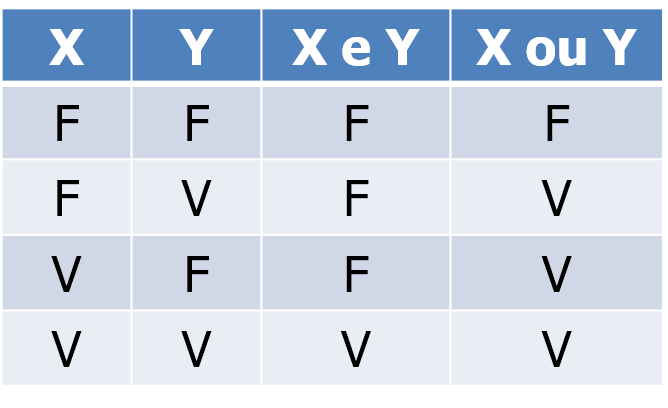
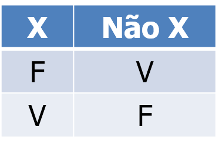
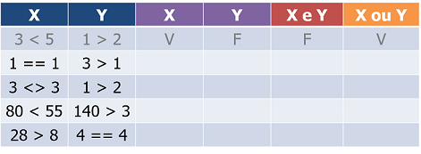
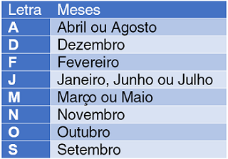

# Apostila de Introdução à Lógica de Programação

A **Lógica de Programação** é a técnica de encadear pensamentos para atingir determinado objetivo por meio de um computador ou outro sistema programável.

Antes de começarmos a programar, é necessário compreender novos conceitos e até rever alguns dos já vistos nas aulas de Matemática.

> Você pode acessar a versão mais atualizada deste material entrando em [github.com/timarcosdias/ilp](https://github.com/timarcosdias/ilp).

> Se encontrar erros ou tiver sugestões, por favor, envie-os para [ti.marcosdias@gmail.com](mailto:ti.marcosdias@gmail.com?Subject=Apostila de Lógica de Programação).

> Os exemplos contidos neste material adotam a sintaxe de uma variante da linguagem Portugol desenvolvida para a ferramenta [Portugol Studio](http://lite.acad.univali.br/portugol/), mantida pela UNIVALI - Universidade do Vale do Itajaí.

## 1. Algoritmo

Podemos definir algoritmo como uma sequência finita e ordenada de passos para a resolução de um problema específico.

Para exemplificar, vamos começar com um algoritmo descritivo para um problema clássico do cotidiano: como fritar ovos?

```
/*
Algoritmo para fritar ovos

1.    pegar frigideira, ovo, óleo e sal
2.    colocar óleo na frigideira
3.    acender o fogo
4.    levar a frigideira ao fogo
5.    esperar o óleo esquentar
6.    colocar o ovo
7.    colocar sal no ovo
8.    retirar quando pronto
*/
```

Percebe que o algoritmo acima é basicamente uma receita? Algoritmos são exatamente como receitas.

Uma boa recomendação para a construção de algoritmos descritivos é sempre utilizar apenas um verbo por linha, já que cada verbo geralmente indicará uma ação diferente a ser tomada.

> O nosso principal objetivo ao estudar Lógica de Programação é compreender como criar programas de computador. Um Programa de Computador nada mais é que um algoritmo escrito com o uso de uma linguagem de computador, ou linguagem de programação, como C, Pascal, Java, JavaScript, PHP etc. Há uma infinidade de linguanges de programação disponíveis mundo afora. Futuramente veremos como elas funcionam.

## 2\. Variável

Na Matemática, variável é o nome que se dá ao termo que substitui um outro desconhecido, como numa equação: `y = 2x + 1`. Em Lógica de Programação, o valor de uma variável pode ser conhecido ou não.

De forma genérica, uma variável é uma referência a um local na memória do computador, onde um valor pode estar armazenado, por exemplo: em um programa de computador, podemos ter uma variável chamada `idade`, que armazena o valor `18`.

### 2.1\. Nomenclatura de variáveis

Há algumas regras a serem seguidas ao nomear variáveis. Algumas linguanges de programação poderão apresentar padrões diferentes, mas há algumas convenções que devem ser sempre seguidas para manter o código legível e livre de erros:

- O nome de uma variável não deve conter espaços ou acentos
- O nome de uma variável não deve conter operadores
- O nome de uma variável não deve ser só um número
- Algumas linguagens de programação diferenciam letras maiúsculas de letras minúsculas, logo: `Nome` pode ser diferente de `nome`
- Variáveis cujo nome seja um substantivo composto, como "data de nascimento", **podem** ser nomeadas com o padrão camelCase: `dataDeNascimento`. Este padrão define que todas as palavras após a primeira devem começar com letra maiúscula. Outra alternativa é utilizar um traço inferior (`_`), ou underline, entre cada palavra: `data_de_nascimento`.

### 2.2\. Atribuição de valores

Atribuir um valor a uma variável é dar um valor a uma variável. É o mesmo que guardar um valor em um espaço da memória.

```
a = 4
```

Pode ser lido como: variável `a` recebe `4`.

```
nome = “José”
```

Pode ser lido como: variável `nome` recebe `José`.

Observe que o símbolo de igualdade, `=`, aqui é utilizado como operador de atribuição. Para igualdade, utilize `==`.

### 2.3\. Tipos de variáveis

O tipo de uma variável define o tipo de valor que ela poderá armazenar. Por exemplo, se precisamos armazenar um número inteiro, podemos criar uma variável do tipo **inteiro**; para armazenar nomes, utilizamos **cadeias de caracteres**.

- **Inteiro ou (int):** número inteiro. Ex.: 10 ou 50.
- **Real (float):** número real. Ex.: 10.5 ou 0.8.
- **Caracter ou Cadeia (string ou char):** número, letras, palavras e/ou outros símbolos. Ex.: "A" ou "abc123" ou "* é um asterisco.". Tenha sempre em mente que valores do tipo caractere ou cadeia de caracteres são representados entre aspas.
- **Lógico (bool):** verdadeiro ou falso, sim ou não, 1 ou 0, true ou false.

### 2.4\. Exercícios com tipos de variáveis

**1\. Informe o tipo de variável adequado para cada item abaixo:**

- a) Idade de uma pessoa
- b) Valor de uma conta de luz
- c) Nome de um cliente
- d) Estado de uma lâmpada (acesa/apagada)
- e) Senha de acesso ao Facebook
- f) Quantidade de litros de combustível abastecidos em um posto
- g) Situação de uma determinada fatura (paga/não paga)
- h) Média final de um aluno

## 3\. Operadores

Um operador é um símbolo que, como seu próprio nome diz, é utilizado para representar operações lógico-matemáticas. Os operadores que iremos utilizar são os operadores aritméticos, os operadores relacionais e os operadores lógicos. Observe que alguns deles, já utilizados na Matemática, terão seu símbolo substituído por outro na Programação.

### 3.1\. Operadores Aritméticos

- **Soma (+):** `1 + 3`
- **Subtração (-):** `5 – 4`
- **Multiplicação (*):** `8 * 8`
- **Divisão (/):** `40 / 5`
- **Resto/Módulo (%):** `20 % 3`
- **Potenciação (^):** `2 ^ 2`

### 3.2\. Operadores Relacionais

- **Igual (==):** `5 == 5`
- **Diferente (!=):** `8 != 80`
- **Maior que (>):** `12 > 11`
- **Menor que (<):** `11 < 12`
- **Maior ou igual (>=):** `18 >= 17`
- **Menor ou igual (<=):** `16 <= 16`

### 3.3\. Operadores Lógicos

- **E/Conjunção (e; &&; and):** `5 == 5 e 9 > 7`
- **OU/Disjunção (ou; ||; or):** `5 > 3 ou 7 >= 1`
- **NÃO/Negação (nao; !; not):** `nao(3 > 2) == falso`

## 4\. Tabela verdade

Uma tabela verdade é uma tabela utilizada em Lógica para verificar se uma expressão é verdadeira ou falsa.

### 4.1\. Operadores "e" e "ou"

No exemplo a seguir, temos a tabela verdade dos operadores lógicos `e` e `ou`. Observe que as variáveis `X` e `Y` representam expressões que podem ser verdadeiras ou falsas de forma independente.



Para compreender como se dá a construção dessa tabela verdade, podemos nos fazer estas duas perguntas:

- `X` e `Y` são verdadeiros?
- `X` ou `Y` são verdadeiros?

Ao questionar se `X` e `Y` são verdadeiros, questionamos se ambos são verdadeiros. Ou seja: a expressão `X e Y` só é verdadeira quando `X == verdadeiro` e `Y == verdadeiro`.

O operador `ou` já funciona de maneira diferente. Ao questionarmos se `X` ou `Y` são verdadeiros, questionamos se pelo menos um deles é verdadeiro. Ou seja: a expressão `X ou Y` é verdadeira quando `X == verdadeiro` e `Y == falso`, ou `X == falso` e `Y == verdadeiro`, ou `X == verdadeiro` e `Y == verdadeiro`.

### 4.2\. Operador "não"

O operador `não` é utilizado para negar uma determinada expressão. Ex.: se `X == verdadeiro`, então `não X == falso`; se `X == falso`, então `não X == verdadeiro`.



### 4.3\. Exercícios com tabela verdade

**1\. Complete a seguinte tabela verdade:**



## 5\. Precedência de operadores

A precedência, ou ordem, de operadores é a convenção que indica a ordem em que as operações devem ser realizadas em uma expressão. A lista abaixo descreve a ordem em que os operadores devem ser considerados:

1. Parênteses e funções
2. Potência e resto
3. Multiplicação e divisão
4. Adição e subtração
5. Operadores relacionais
6. Operadores lógicos

No exemplo abaixo, a multiplicação deve ser resolvida antes da soma.

```
3 + 4 * 9
3 + 36
39
```

Neste exemplo, a parte da expressão entre parênteses é resolvida antes da multiplicação.

```
(3 + 4) * 9
7 * 9
63
```

Quando operadores de mesma prioridade se chocam, a operação mais à esquerda prevalece sobre as demais. Ex.:

```
3 * 4 / 3
12 / 3
4
```

Neste exemplo, o operador de soma tem prioridade sobre os operadores relacionais, e os operadores relacionais têm prioridade sobre o operador lógico.

```
10 < 9 e 6 + 3 > 10
10 < 9 e 9 > 10
F e F
F
```

Para facilitar, isole as expressões que estão antes e após o operador lógico, resolva-as e só então compare seus resultados através do operador lógico.

### 5.1\. Exercícios com expressões

**1\. Indique o resultado das expressões seguindo as regras de precedência dos operadores.**

- a) `2 + 3 - 5 * 8 / 4`
- b) `7 * 4 / 2 + 9 - 6`
- c) `(4 + 2) * 3 / 4`
- d) `7 > 2 e 3 -5 < 8`
- e) `8 > 12 e 5 < 3 + 4`

## 6\. Primeiros passos em programação

Você deve ter notado no início deste material que mencionamos que a sintaxe utilizada em nossos exemplos seria a mesma de uma variante da linguagem Portugol.

Em Lógica de Programação, a **sintaxe** está ligada à **estrutura** da linguagem de programação. Ela é o conjunto de regras que definem a forma correta de composição das estruturas básicas de uma linguagem. É o que deve responder à pergunta: como construir tal estrutura corretamente?

Outro conceito que precisamos compreender é o de **semântica**. Em Lógica de Programação, a semântica está ligada ao **significado** de um determinado código. A semântica deve responder à pergunta: tal código faz realmente o que se espera que ele faça?

A seguir, são abordados alguns comandos básicos para que possamos finalmente começar a programar.

### 6.1\. Declaração de variáveis

Antes que uma variável possa ser utilizada para armazenamento de um valor qualquer, ela deve ser declarada, ou seja: precisamos reservar aquele pequeno espaço na memória do computador e nomeá-lo para uso futuro:

```
inteiro idade
```

No exemplo acima, declaramos a variável `idade` como do tipo `inteiro`.

Até que a variável `idade` seja inicializada, ou seja, até que ela receba algum valor, seu conteúdo será nulo ou vazio. É possível inicializar uma variável juntamente à sua declaração:

```
cadeia nome = "Fulano"
```

Mas podemos também declarar uma variável e inicializá-la com um valor lido:

```
real preco
leia(preco)
```

O comando `leia()` utilizado no exemplo acima será abordado na próxima seção.

Antes de prosseguirmos, lembre-se que você pode declarar quantas variáveis quiser e de diversos tipos diferentes em um mesmo programa, por exemplo:

```
cadeia nome, sobrenome, apelido
real peso, altura
inteiro idade
```

### 6.2\. Comandos de entrada

Comandos de entrada são os responsáveis por receber uma informação do usuário. Ex.: leia, escute, ouça, receba.

```
leia(nome)
```

Quando se trata de linguagens de programação, os comandos costumam ter um par de parênteses logo após seu nome, onde serão informadas opções para sua execução. Neste exemplo, o valor lido pelo comando `leia()` é armazenado na variável `nome`.

### 6.3\. Comandos de saída

Comandos de saída são os responsáveis por enviar uma informação ao usuário. Ex.: escreva, imprima, mostre, exiba.

```
escreva(“Olá, mundo!”)
```

Neste exemplo, o comando `escreva()` irá exibir na tela o texto `Olá, mundo!`.

### 6.4\. Um básico exemplo de entrada, processamento e saída

Neste exemplo, iremos declarar três variáveis: `a`, `b` e `c`, todas do tipo `inteiro`. Faremos a leitura de dois valores e os armazenaremos nas variáveis `a` e `b`. A variável `c` receberá a soma de `a` e `b`. Por fim, escreveremos o valor contido em `c`.

```
inteiro a, b, c
leia(a)
leia(b)
c = a + b
escreva(c)
```

Perceba que as últimas duas linhas do exemplo acima poderiam ser substituídas por:

```
escreva(a + b + c)
```

## 7\. Problemas com caminhos diferentes

Em algumas situações precisamos fazer decisões, tomar rumos diferentes para situações diferentes. Isso se repete na programação, e é por isso que existem as **estruturas de decisão** (ou estruturas de controle).

As duas principais estruturas de decisão e que estão presentes na maioria das linguagens de programação são o se/senao (if/else, em inglês) e o escolha/caso (switch/case, em inglês).

### 7.1. Se/Senão

### 7.2. Escolha/Caso

## 8. Repetições

## 9. Referências Bibliográficas

- LOPES, Anita. GARCIA, Guto. **Introdução à programação – 500 algoritmos resolvidos**. Rio de Janeiro: Elsevier, 2002 - 15ª Tiragem.

## Lista 1 - Expressões, entrada e saída de dados

1. Leia dois números inteiros e escreva o resultado de sua soma.
2. Leia dois números inteiros e escreva o resultado de sua subtração.
3. Leia dois números inteiros e escreva o resultado de sua multiplicação.
4. Leia dois números inteiros (`a` e `b`) e escreva o resultado da divisão `a / b`.
5. Leia dois números inteiros (`a` e `b`) e escreva o resultado do resto da divisão `a % b`.
6. Leia dois números reais e escreva o resultado de sua soma.
7. Leia o nome de uma pessoa e escreva uma frase de saudação, como: `Olá, Fulano`.
8. A média aritmética de dois ou mais termos é o quociente do resultado da divisão da soma dos números dados pela quantidade de números somados. Elabore um algoritmo que leia as 4 notas de um aluno e escreva sua média aritmética.
9. A autonomia de um veículo é baseada em quantos quilômetros ele consegue percorrer a cada litro de combustível consumido. Por exemplo, é comum afirmar que tal carro é capaz de fazer 15 quilômetros por litro de combustível. Com base nisso, elabore um algoritmo que leia uma distância percorrida em quilômetros e uma quantidade de litros de combustível consumidos, e informe quantos quilômetros este veículo pode percorrer com cada litro.
10. A velocidade média de um veículo pode ser calculada se tivermos os seguintes valores: a distância percorrida e o tempo gasto para percorrer esta distância. Com base nisso, elabore um algoritmo que leia uma distância percorrida em quilômetros e o tempo gasto em horas, e informe a velocidade média desse veículo.
11. Alguns países de língua inglesa, como os EUA, utilizam da unidade de medida grau Fahrenheit como escala de temperatura. Para converter uma temperatura de Celsius para Fahrenheit, podemos aplicar a fórmula `F=(9*C+160)/5` ou a fórmula `F=C*1.8+32`, onde F é a temperatura em Fahrenheit e C a temperatura em Celsius. Elabore um algoritmo que leia uma temperatura em graus Celsius e a escreva convertida em graus Fahrenheit.
12. Para auxiliar uma loja que deseja parcelar o valor das compras de seus clientes, elabore um algoritmo que leia o valor de uma compra e o número de prestações desejadas, e escreva o valor das prestações.
13. No comércio, os preços dos produtos geralmente são definidos com base em uma margem percentual de lucro. Considere um produto adquirido por uma loja pelo valor de R$ 100,00\. Se esta loja aplicar a este produto um percentual de 15% de lucro, o produto será revendido pelo valor de R$ 115,00\. Elabore um algoritmo que leia o valor de compra de um produto e o percentual de lucro desejado, e escreva o valor de revenda deste produto.
14. Você foi encarregado de realizar uma pesquisa sobre Inclusão Digital. A sua pesquisa deverá apresentar o percentual de alunos da sua escola que possuem acesso à internet. Para isso, elabore um algoritmo que leia o número total de alunos da sua escola e o número de alunos que possuem acesso à internet, por fim, com base nestes dados, escreva o percentual de alunos com acesso à internet. Ex.: Em uma escola com 200 alunos, apenas 50 alunos possuem acesso à internet, o que equivale a 25% destes 200 alunos.
15. Em uma pequena loja de eletrônica são vendidos `resistores`, `diodos` e `transistores`. Seus preços são `R$ 0.70`, `R$ 0.80` e `R$ 0.95`, respectivamente. Têm-se os preços unitários de cada tipo de peça e sabe-se que sobre estes preços incidem descontos de `5%` para `resistores`, `6%` para `diodos` e `9%` para `transistores`. Elabore um programa que leia o nome do cliente e as quantidades de cada item comprado; e escreva o valor total de desconto e o valor líquido a ser pago pela compra.

## Lista 2 - Estruturas de decisão: Se/Senão

1. Leia um número inteiro e informe se este número é par ou ímpar.
2. Leia a idade de uma pessoa e informe se ela já chegou à maioridade. Se ela ainda não chegou, informe quantos anos faltam para a maioridade.
3. Construa um algoritmo que leia um número inteiro A e um número inteiro B. Verifique qual dos dois números é maior e o escreva.
4. Considerando uma pista em que a velocidade máxima permitida é de 110 km/h, leia a velocidade de um veículo e informe se ele excedeu ou não a velocidade máxima permitida.
5. Considerando que a temperatura média ideal do corpo humano varia entre 36° C e 36,7° C, elabore um algritmo que, dada uma temperatura lida, informe se esta pessoa está com febre.
6. Complemente o algoritmo anterior, adicionando a ele a capacidade de informar se a pessoa está com hipotermia (abaixo da temperatura média ideal); dentro da temperatura média ideal ou com febre.
7. Elabore um algoritmo que leia um número inteiro e informe se este número é um múltiplo de 7.
8. Leia um número inteiro e informe se este número é par e também divisível por 3.
9. Para auxiliar um cliente a escolher o produto mais barato em um conjunto de 3 produtos, crie um programa que leia os preços de 3 produtos e informe qual deles é o mais barato.
10. Construa um programa que leia um caractere e informe se este caractere é uma vogal.
11. Leia dois números inteiros `x` e `y`, e informe se `x` é divisível por `y`.
12. Considerando que no Brasil é possível votar a partir dos 16 anos de idade, leia o ano de nascimento de uma pessoa e informe se ela poderá votar no ano atual. Ignore mês e dia de nascimento.
13. Considerando que o ano possui 12 meses, leia um número inteiro de 1 a 12 e informe o mês que corresponde a este número.
14. Leia dois números inteiros `x` e `y` e escreva dentre as seguintes hipóteses a verdadeira: 1\. `x` e `y` são pares; 2\. `x` e `y` são ímpares; 3\. `x` é par e `y` é ímpar; 4\. `x` é ímpar e `y` é par.
15. Para auxiliar a definir os períodos mais quente e mais frio do dia, elabore um algortimo que leia a temperatura do período matutino, a temperatura do período vespertino e a temperatura do período noturno, ao fim escreva qual destes períodos foi o mais frio e qual foi o mais quente.
16. Construa um algoritmo que leia as medidas dos lados de um triângulo e informe se este triângulo é equilátero, isósceles ou escaleno.
17. Construa um algoritmo que leia um número real e, se ele for maior do que 5, então escreva a metade deste número. Ex.: se leio o número 12, 12 é maior que 5; a metade de 12 é 6; devo escrever 6.
18. Construa um algoritmo que leia um número inteiro e, se ele for positivo, escreva uma mensagem que informe se este número é ou não divisível por 2.
19. Construa um algoritmo que leia dois números inteiros diferentes e escreva-os em ordem crescente.
20. Construa um algoritmo que leia três números inteiros e escreva-os em ordem decrescente.
21. Crie um algoritmo que leia dois números inteiros e escreva uma mensagem dizendo se estes números são iguais ou diferentes.
22. O IMC (Índice de Massa Corporal) é uma unidade de medida internacional usada para calcular se uma pessoa está no seu peso ideal. A fórmula mais genérica de cálculo de IMC é `imc = peso / altura * altura`, onde o peso é dado em quilos e a altura em metros. Há uma tabela que define uma classificação para cada faixa de IMC. Segundo esta tabela, pessoas com IMC menor ou igual a 18.5 estão abaixo do peso; pessoas com IMC maior que 18.5 e menor que 25 estão no peso ideal; já as pessoas com IMC maior ou igual a 25 estão acima do peso. Elabore um algoritmo que leia peso e altura de uma pessoa, informe seu IMC e também se ela está abaixo do peso, no peso ideal ou acima do peso.

## Lista 3 - Estruturas de decisão: Escolha/Caso

1. Elabore um programa que leia uma letra e informe se esta letra é uma vogal ou uma consoante.
2. Elabore um programa que funcione como uma calculadora simples. Seu programa deverá começar mostrando uma mensagem de apresentação, depois solicitar que o usuário entre com dois números reais (`a` e `b`) e finalmente ler os dois números reais digitados.  Logo após, o programa deverá solicitar ao usuário que escolha uma das seguintes opções: somar, subtrair, multiplicar ou dividir. Com base na escolha do usuário, exiba o resultado da operação escolhida envolvendo `a` e `b`.
3. Considerando que o ano possui 12 meses, leia um número inteiro entre 1 e 12 e, com o uso da estrutura de controle escolha/caso, informe o nome do mês que corresponde a este número.
4. Verificar a quantidade de combustível que será gasta em uma viagem é de grande importância para o condutor. Considerando que um carro do tipo A é capaz de percorrer 12 quilômetros a cada litro de combustível gasto, um do tipo B percorre 9 quilômetros a cada litro e um do tipo C, 8 quilômetros por litro, elabore um programa que leia a distância a ser viajada e o tipo de carro, e com base nestes dados informe quantos litros de combustível serão gastos.
5. Construa um programa que funcione como um menu para uma lanchonete. Seu programa deverá iniciar mostrando o nome da sua lanchonete. Em seguida, seu programa deverá pedir o nome do usuário e, após lê-lo, exibir uma mensagem de boas vindas. Após isso, seu programa deverá mostrar as opções de lanches disponíveis e seus preços: mostre pelo menos 6 opções de lanches diferentes. Permita que o usuário escolha uma das opções de lanches e, após a escolha, mostre a ele uma mensagem informando a opção que ele escolheu e quanto seu pedido irá custar. Lembre-se de avisar ao usuário caso ele escolha uma opção inexistente.
6. Construa um programa que leia a primeira letra do mês de nascimento de uma pessoa e informe em quais meses essa pessoa pode ter nascido. Caso não exista um mês que comece com a letra lida, informe ao usuário que ele se enganou.



## Lista 4 - Laços de Repetição: Enquanto

1. Construa um programa que comece lendo um número inteiro qualquer. Este número será chamado de `piso`. Após isso, seu programa deverá ler um outro número inteiro, que poderá ser chamado de `proximo`, enquanto `proximo` for maior ou igual a `piso`.
2. Elabore um algoritmo que escreva todos os números inteiros de 1 a 100.
3. Elabore um algoritmo que escreva apenas os números pares de 1 a 100.
4. Elabore um algoritmo que escreva apenas os números ímpares de 1 a 100.
5. Elabore um algoritmo que escreva todos os números inteiros de 200 a 400.
6. Elabore um algoritmo que escreva apenas os números pares de 300 a 600.
7. Elabore um algoritmo que escreva apenas os números ímpares de 750 a 1500.
8. Construa um programa que calcule as médias aritméticas de todos os alunos de uma turma. Seu programa deverá funcionar da seguinte maneira: leia o nome do aluno; leia as notas dos 4 bimestres; mostre a média aritmética do aluno; pergunte se o usuário deseja continuar; se o usuário desejar continuar, repita todo o processo, senão, pare.

## Lista 5 - Laços de Repetição: Faça/Enquanto

1. Construa um programa que comece lendo um número inteiro qualquer. Este número será chamado de `piso`. Após isso, seu programa deverá ler um outro número inteiro, que poderá ser chamado de `proximo`, enquanto `proximo` for maior ou igual a `piso`.
2. Elabore um algoritmo que escreva todos os números inteiros de 1 a 100.
3. Elabore um algoritmo que escreva apenas os números pares de 1 a 100.
4. Elabore um algoritmo que escreva apenas os números ímpares de 1 a 100.
5. Elabore um algoritmo que escreva todos os números inteiros de 200 a 400.
6. Elabore um algoritmo que escreva apenas os números pares de 300 a 600.
7. Elabore um algoritmo que escreva apenas os números ímpares de 750 a 1500.
8. Construa um programa que calcule as médias aritméticas de todos os alunos de uma turma. Seu programa deverá funcionar da seguinte maneira: leia o nome do aluno; leia as notas dos 4 bimestres; mostre a média aritmética do aluno; pergunte se o usuário deseja continuar; se o usuário desejar continuar, repita todo o processo, senão, pare.

## Lista 6 - Laços de Repetição: Para

1. Elabore um algoritmo que escreva todos os números inteiros de 1 a 100.
2. Elabore um algoritmo que escreva apenas os números pares de 1 a 100.
3. Elabore um algoritmo que escreva apenas os números ímpares de 1 a 100.
4. Elabore um algoritmo que escreva todos os números inteiros de 200 a 400.
5. Elabore um algoritmo que escreva apenas os números pares de 300 a 600.
6. Elabore um algoritmo que escreva apenas os números ímpares de 750 a 1500.
